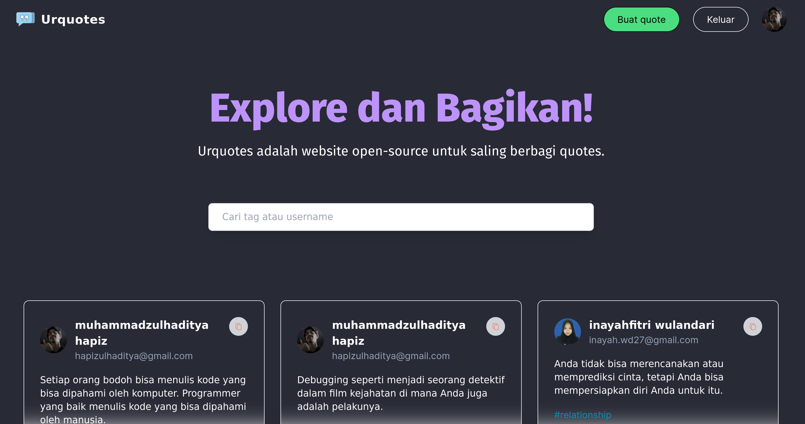

# Urquotes

> A website to sharing quotes create with Next.js and MongoDB for database.
> Link to website [_here_](https://urquotes.vercel.app/).

## Table of Contents

- [General Info](#general-information)
- [Technologies Used](#technologies-used)
- [Features](#features)
- [Screenshots](#screenshots)
- [Setup](#setup)
- [Project Status](#project-status)
- [Room for Improvement](#room-for-improvement)
- [Contact](#contact)

## General Information

- Discover and sharing quotes.
- This website is used to post and sharing a quotes.

## Technologies Used

- Next.js - version 13.0
- NextAuth - version 4.22.1
- MongoDB - version 6.0

## Features

- Login using Google Authentication.
- Search, post, edit and delete a quotes.
- Save user data using MongoDB.
- Implementation of frontend and backend features in Next.js and implementing CRUD features.

## Screenshots



## Setup

To run this project, install it locally using npm:

```bash
$ cd ../urquotes
$ npm install
$ npm run dev
```

Open [http://localhost:3000](http://localhost:3000) with your browser to see the result.

## Project Status

Project is: _complete._ <!-- / _complete_ / _no longer being worked on_. reason ? -->

## Room for Improvement

- Add some functions for better experience.
- Added a comment feature on each quote.

## Acknowledgements

- The theme and color palette on this website are inspired by the [Dracula](https://draculatheme.com/) theme.

## Contact

Created by [@Zulhaditya](https://itsmyportofolio.netlify.app/) - feel free to contact me!
